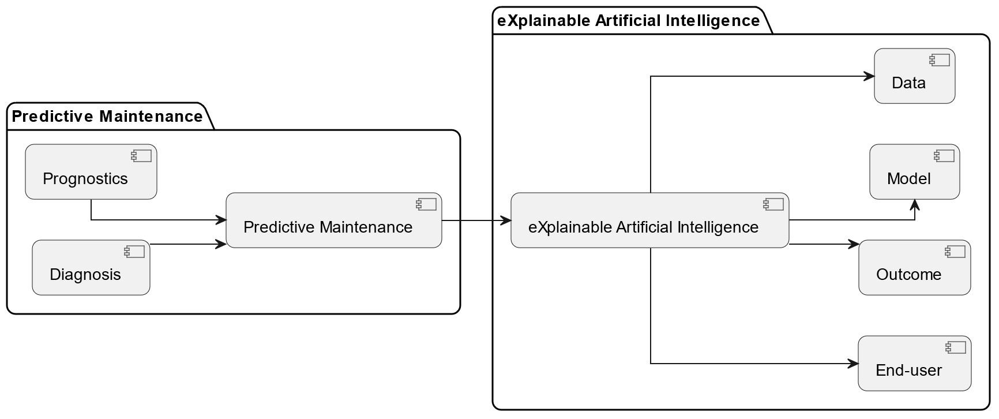

# msc-research

Explainable Artificial Intelligence (XAI) Model for Predictive Maintenance (PdM) in Smart Agricultural Facilities (SAF)

## XAI for PdM in SAF

[](https://www.gnu.org/licenses/old-licenses/gpl-2.0.en.html)
[](https://www.ieee.org/publications/rights/index.html)
[](https://doi.org/10.1109/access.2024.3365586)
[](https://www.linkedin.com/in/iammelvink)

## Overview

<div align="center">
  <figure>
    
    <figcaption>Predictive Maintenance (PdM) and eXplainable Artificial Intelligence (XAI) illustration</figcaption>
  </figure>
</div>

<br/>

<!-- Blank line here -->

This repository supports the paper "Explainable Artificial Intelligence Model for Predictive Maintenance in Smart Agricultural Facilities," which can be found at the following link: [Open Access Paper Link](https://doi.org/10.1109/access.2024.3365586)

## Abstract

Artificial Intelligence (AI) in Smart Agricultural Facilities (SAF) often lacks explainability, hindering farmers from taking full advantage of their capabilities. This study tackles this gap by introducing a model that combines eXplainable Artificial Intelligence (XAI), with Predictive Maintenance (PdM). The model aims to provide both predictive insights and explanations across four key dimensions, namely data, model, outcome, and end-user. This approach marks a shift in agricultural AI, reshaping how these technologies are understood and applied. The model outperforms related studies, showing quantifiable improvements. Specifically, the Long-Short-Term Memory (LSTM) classifier shows a 5.81% rise in accuracy. The eXtreme Gradient Boosting (XGBoost) classifier exhibits a 7.09% higher F1 score, 10.66% increased accuracy, and a 4.29% increase in Receiver Operating Characteristic-Area Under the Curve (ROC-AUC). These results could lead to more precise maintenance predictions in real-world settings. This study also provides insights into data purity, global and local explanations, and counterfactual scenarios for PdM in SAF. It advances AI by emphasising the importance of explainability beyond traditional accuracy metrics. The results confirm the superiority of the proposed model, marking a significant contribution to PdM in SAF. Moreover, this study promotes the understanding of AI in agriculture, emphasising explainability dimensions. Future research directions are advocated, including multi-modal data integration and implementing Human-in-the-Loop (HITL) systems aimed at improving the effectiveness of AI and addressing ethical concerns such as Fairness, Accountability, and Transparency (FAT) in agricultural AI applications.

## This is the Python section

Written in **Python**

1. Methodologies/Project Management:

   - Agile

2. Coding Practices:

   - OOP (Object Oriented Programming)
   - MVC (Model View Controller)

3. Programming Languages/Frameworks:

   - R
   - Python
   - PlantUML - Unified Modeling Language (UML)

## Live Demo (loading...)

- [dev](https://<>.amazonaws.com/dev 'dev')

## Instructions

1. Make sure you have these installed

   - [Mambaforge (faster Anaconda)](https://github.com/conda-forge/miniforge/releases/ 'Mambaforge (faster Anaconda)')
     - I used version 23.3.1-1 at time of creation

2. Clone `ONLY THE LATEST COMMIT` of this repository into your local machine using the terminal (mac) or
   [Gitbash (PC)](https://git-scm.com/download/win 'Gitbash (PC)') `to save storage space`

   ```sh
   git clone https://github.com/iammelvink/msc-research.git --depth=1
   ```

3. ```sh
   cd "py-imp"
   ```

4. Setup Mambaforge base env

   ```sh
   conda env update --name base --file tools-for-base.yml && conda activate base
   ```

5. Setup mamba project env:

   ```sh
   mamba env create --name project_n --file tools-tf.yml && mamba activate project_n
   ```

   5.1. ONLY For Linux:

      ```sh
      sudo apt update && sudo apt upgrade -y && ubuntu-drivers devices
      ```

      ```sh
      sudo apt install nvidia-driver -< latest version available for your pc>
      ```

      ```sh
      sudo reboot
      ```

      ```sh
      nvidia-smi
      ```

      ```sh
      sudo prime-select query && sudo prime-select nvidia && sudo prime-select query
      ```

      ```sh
      mamba install -c conda-forge cudatoolkit=11.2 --yes && python -m pip install --force-reinstall --upgrade nvidia_cudnn_cu11==8.9.2.26
      ```

      ```sh
      python -m pip install --force-reinstall --upgrade https://storage.googleapis.com/tensorflow/linux/gpu/tensorflow_gpu-2.10.1-cp38-cp38-manylinux_2_17_x86_64.manylinux2014_x86_64.whl && mamba install -c nvidia cuda-nvcc=11.3.58 --yes
      ```

      ```sh
      mkdir -p $CONDA_PREFIX/etc/conda/activate.d && echo 'CUDNN_PATH=$(dirname $(python -c "import nvidia.cudnn;print(nvidia.cudnn.__file__)"))' >> $CONDA_PREFIX/etc/conda/activate.d/env_vars.sh && echo 'export LD_LIBRARY_PATH=$LD_LIBRARY_PATH:$CONDA_PREFIX/lib/:$CUDNN_PATH/lib' >> $CONDA_PREFIX/etc/conda/activate.d/env_vars.sh && mkdir -p $CONDA_PREFIX/etc/conda/activate.d && printf 'export XLA_FLAGS=--xla_gpu_cuda_data_dir=$CONDA_PREFIX/lib/\n' >> $CONDA_PREFIX/etc/conda/activate.d/env_vars.sh && source $CONDA_PREFIX/etc/conda/activate.d/env_vars.sh && mkdir -p $CONDA_PREFIX/lib/nvvm/libdevice && cp $CONDA_PREFIX/lib/libdevice.10.bc $CONDA_PREFIX/lib/nvvm/libdevice/
      ```

6. Setup "pip" project env:

   ```sh
   poetry install --all-extras
   ```

7. Add env to kernel:

   ```sh
   python -m ipykernel install --user --name project_n --display-name "Python 3.8 (project_n)"
   ```

8. Run JupyterLab

   ```sh
   jupyterlab
   ```

9. Open a `.ipynb` file in the `code` directory to get started

10. Enjoy!

## Citation

If you use this code or find the paper helpful in your research, please cite it as follows:

```bibtex
@article{10433503,
   title = {Explainable Artificial Intelligence Model for Predictive Maintenance in Smart Agricultural Facilities},
   author = {Kisten, Melvin and Ezugwu, Absalom El-Shamir and Olusanya, Micheal O.},
   journal = {IEEE Access},
   volume = {12},
   pages = {24348-24367},
   ISSN = {2169-3536},
   DOI = {10.1109/ACCESS.2024.3365586},
   year = {2024},
   type = {Journal Article}
}
```

## More Stuff

Check out some other stuff on
[Melvin K](https://github.com/iammelvink 'Melvin K GitHub page')
